Crear un Pod privado
===

Nos otros a lo largo de nuestra carrera como desarrolladores vamos creando diversas funciones de código, código que podemos re-implementar en futuros proyectos. Podemos conservar este código en librerías (frameworks para Swift), Cocoa Pods no es más que subir nuestras librerías a repositorios publicos o privados y posteriormente implementarlos de una manera simple en nuestro proyecto desde esos repositorios.

## Requisito

Como requerimiento debemos tener nuestra claseo o clases con el código que queremos guardar en la librería y subir al pod. Para este ejemplo yo usaré un código de cifrado.

## 1. Creamos un repositorio

Para este usaremos <a href="https://gitlab.com/">Gitlab</a> pero podemos usar BitBucket o cualquier otro.

<p>
	
</p>

<p>
	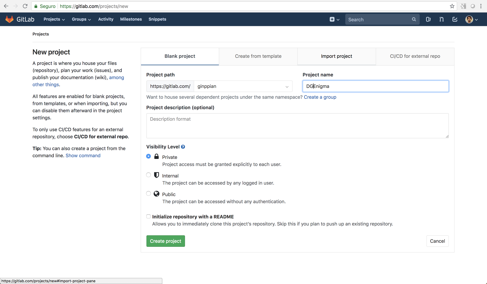
</p>

<p>
	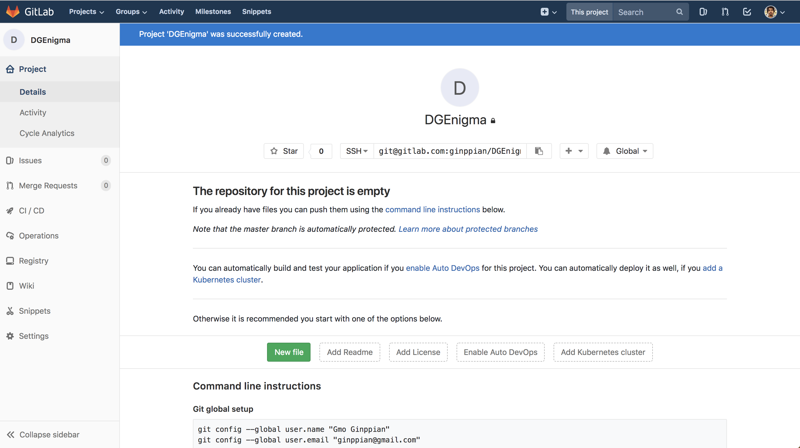
</p>

## 2. Creamos un framework en Xcode

Creamos un framework adaptando nuestra funcionalidad para que se pueda usar instanciando una clase o llamando a un método de esa clase. En mi caso creare una nueva clase y agregare las funciones a esta.

<p>
	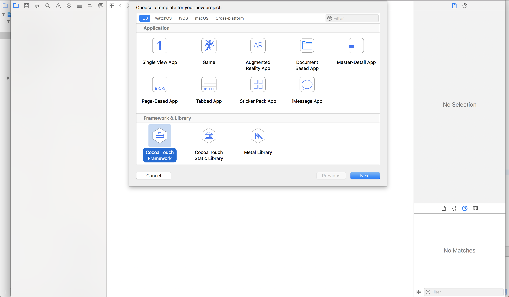
</p>

<p>
	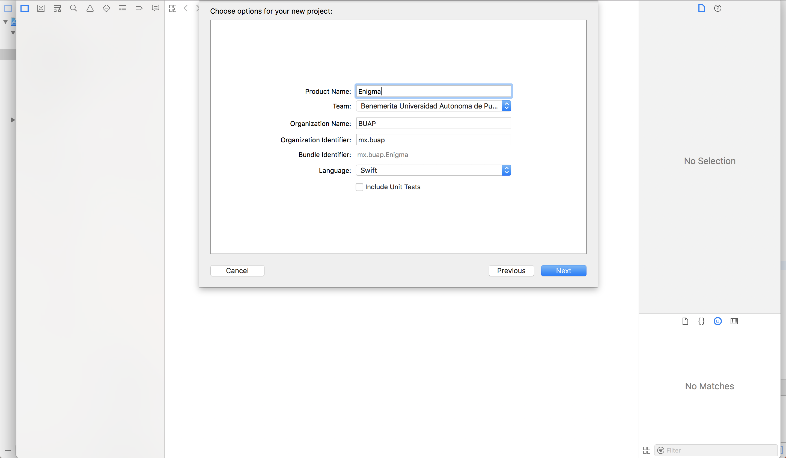
</p>

<p>
	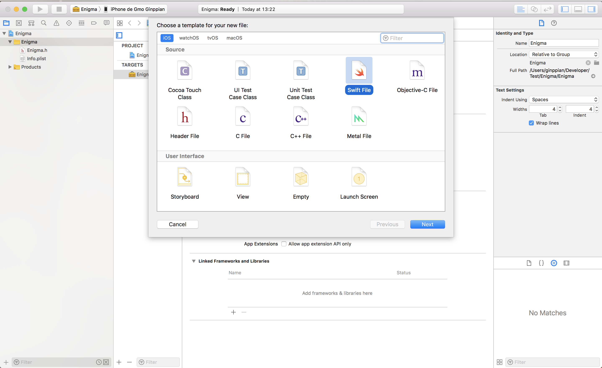
</p>

En mi caso la clase se llama igual que el framework pero puede variar.

<p>
	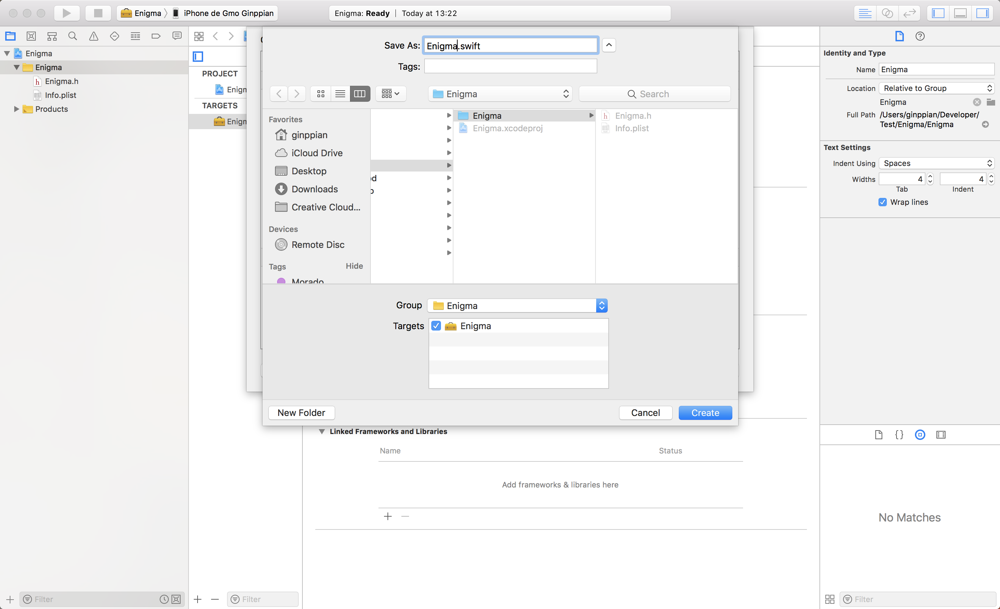
</p>

<p>
	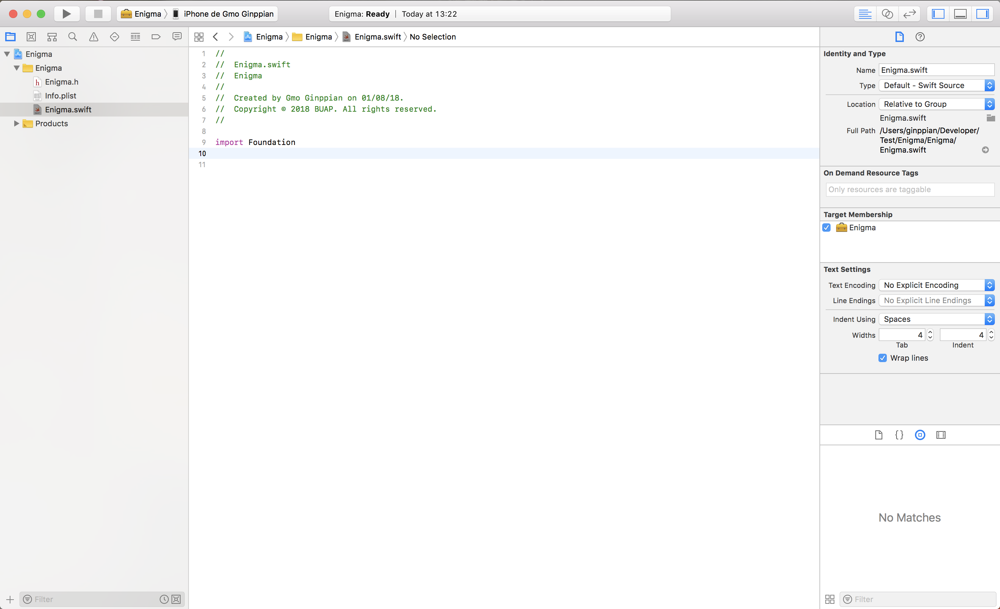
</p>

Implementamos todo lo necesario.

## 3. Subimos el framework al repositorio.

```
> cd existing_folder
> git init
> git remote add origin url_repo.git
> git add .
> git commit -m "Initial commit"
> git push -u origin master
```

Hay un punto importante para un mejor ordenamiento manejaremos el versionado de nuestro pod con **tags**. Así cada vez que hagamos cambios deberemos subirlos con un *git push* normal y posteriormente hacer un tag con un versionado y de nuevo haremos un *git push* pero con tags.

```
git tag 0.0.1
git push origin master --tags
```

<p>
	
</p>


## 4. Creamos el archivo de configuración podspect

Posicionados donde se encuentra nuestro proyecto, ponemos:

```
> pod spec create DGEnigma
```

nos crara un archivo .podspect lo abrimos y remplazamos todo con la siguiente planilla:

```ruby
Pod::Spec.new do |s|
  s.name             = ""

  s.version          = ""

  s.summary          = ""

  s.homepage         = ""

  s.license          = { :type => 'MIT', :text => 'THE SOFTWARE IS PROVIDED "AS IS", WITHOUT WARRANTY OF ANY KIND, EXPRESS OR IMPLIED, INCLUDING BUT NOT LIMITED TO THE WARRANTIES OF MERCHANTABILITY, FITNESS FOR A PARTICULAR PURPOSE AND NONINFRINGEMENT. IN NO EVENT SHALL THE AUTHORS OR COPYRIGHT HOLDERS BE LIABLE FOR ANY CLAIM, DAMAGES OR OTHER LIABILITY, WHETHER IN AN ACTION OF CONTRACT, TORT OR OTHERWISE, ARISING FROM, OUT OF OR IN CONNECTION WITH THE SOFTWARE OR THE USE OR OTHER DEALINGS IN THE SOFTWARE.' }

  s.author           = { "" => "" }

  s.platform         = :ios, '9.0'

  s.source           = { :git => "", :tag => "#{s.version}" }

  s.source_files     = '/**/*.{swift}'

  s.requires_arc     = true

  s.exclude_files    = 'Classes/Exclude'
  
end
```
Se verá algo así:

<p>
	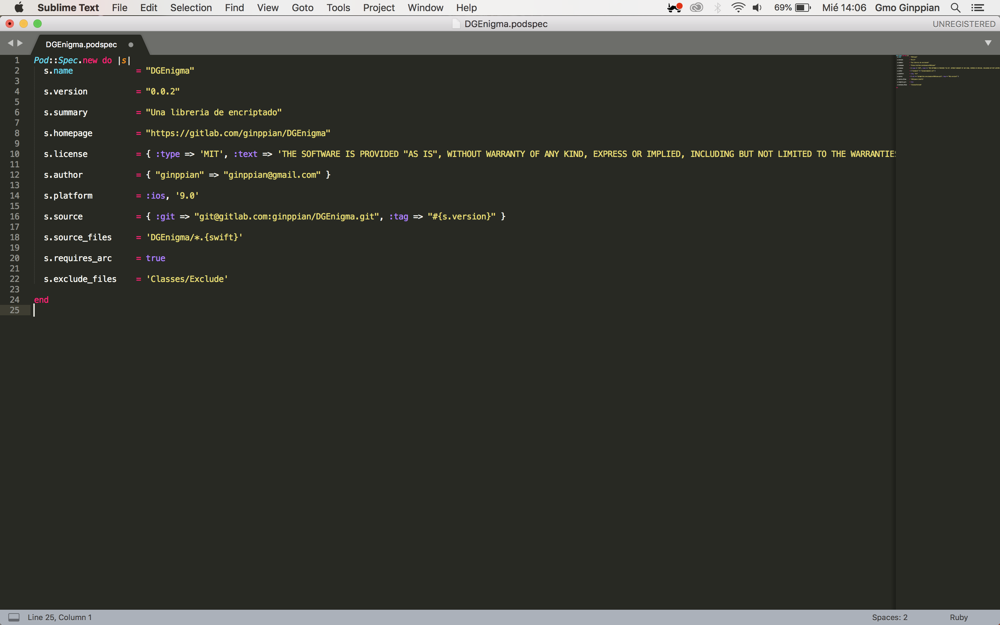
</p>

El *s.version* debe coincidir con el tag de nuestro repo.<br>
El *s.source_files* debe marcar la ruta donde se encuentran nuestros archivos o clases.

Hay que tener un poco de cuidado con este archivo de configuración.


## 5. Asociamos el pod a nuestro repositorio.

Aparte del archivo de configuración podspec debemos agregar vincular el pod con nuestro repositorio.

```ruby
> pod repo add DGEnigma url_repo.git
```

<p>
	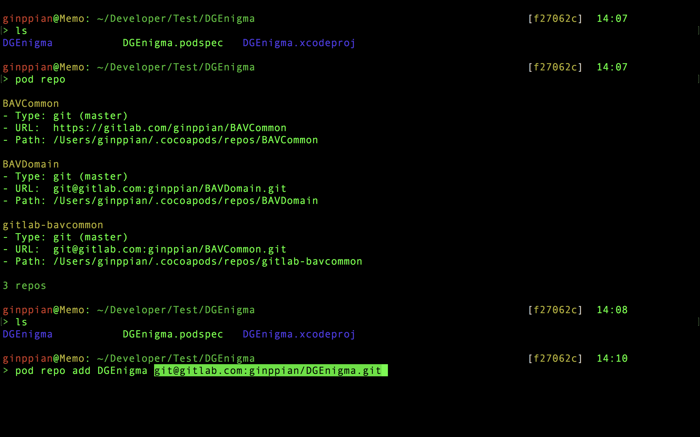
</p>

comprobamos que ya exista con:

```ruby
> pod repo
```

<p>
	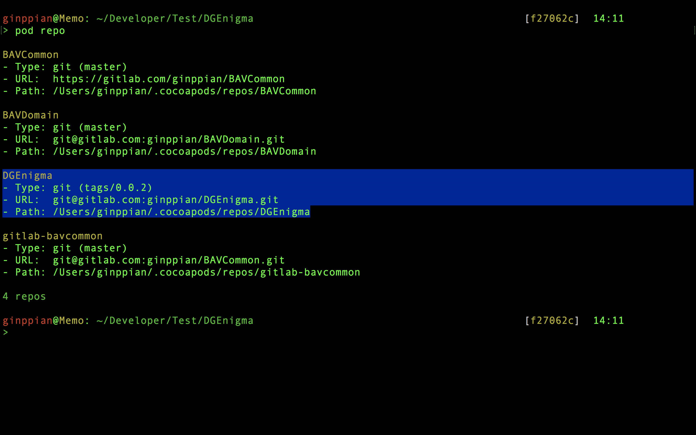
</p>


## 6. Subimos nuestro pod

Subimos nuestro pod con un push:

```ruby
> pod repo push DGEnigma DGEnigma.podspec
```

si nos pide especifidar la versión de Swift basta con:

```ruby
> pod repo push DGEnigma DGEnigma.podspec --swift-version=3.2
```

se verá algo así

<p>
	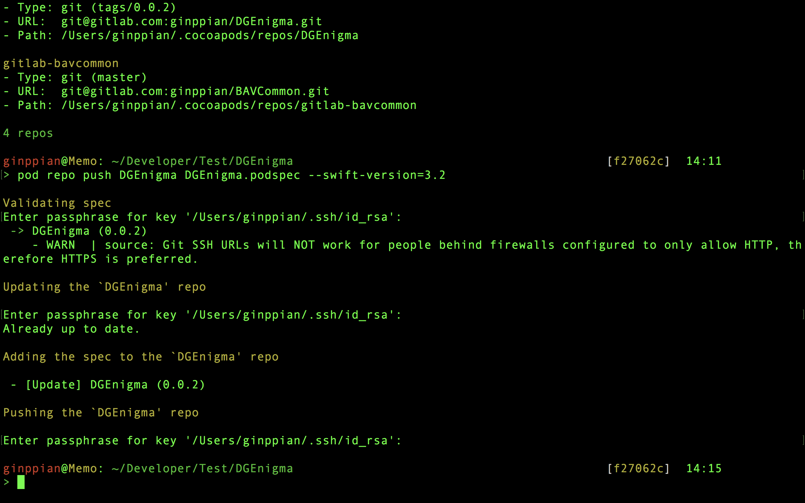
</p>

## 7. Implementar el pod

#### 7.1 
Creamos un proyecto prueba y hacemos un *pod init*

<p>
	
</p>

#### 7.2

Debe coincidir la plataforma con el target de nuestro proyecto.

<p>
	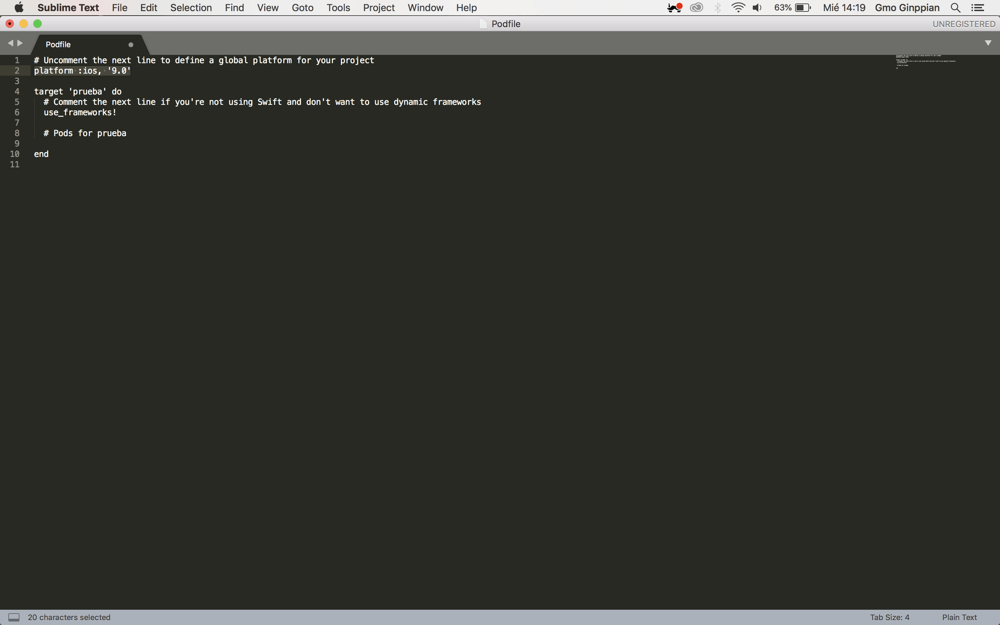
</p>

<p>
	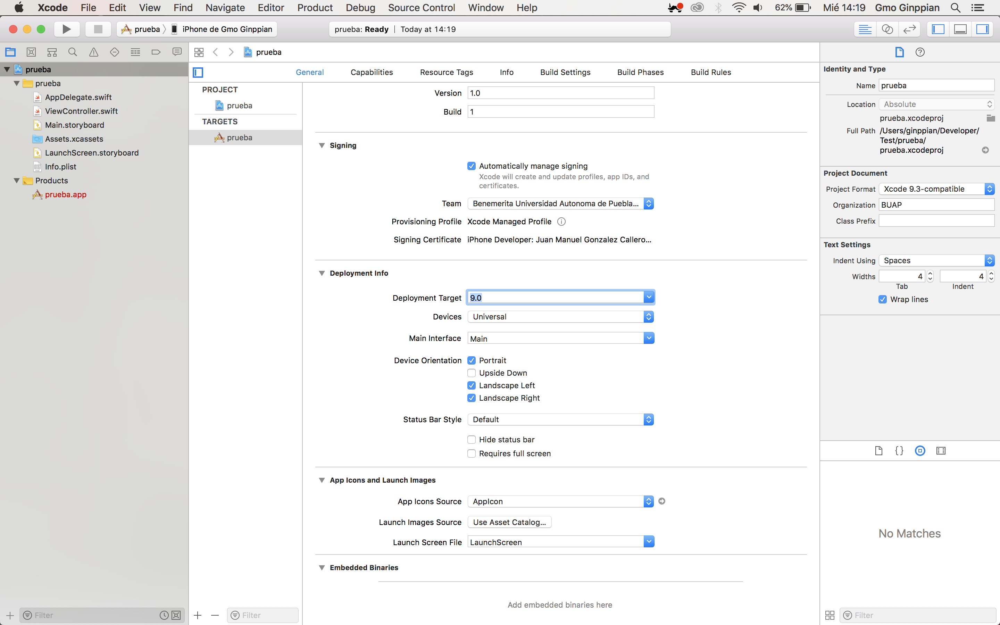
</p>

#### 7.3

Agregamos el enlace de nuestro repo y el pod al *Podfile*:

<p>
	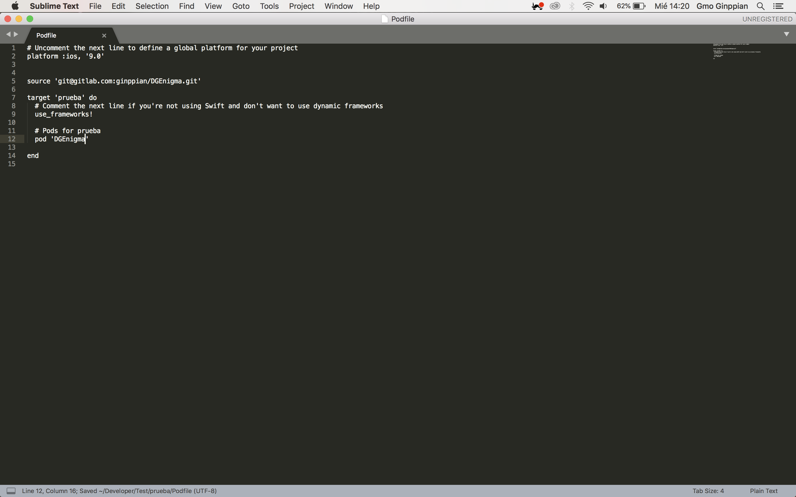
</p>

#### 7.4

Corremos *pod install*

<p>
	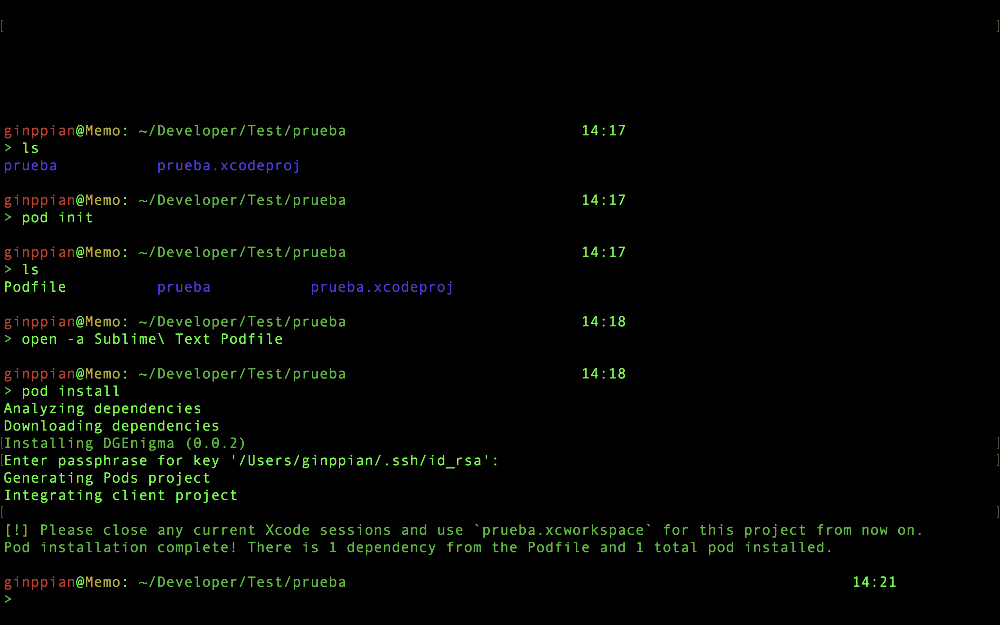
</p>

#### 7.5

Cerramos nuestro proyecto y re abrimos el archivo con terminacion .xcworkspace

#### 7.6

Importamos el pod, sólo la primera vez, después quedará para todo el proyecto. En el ejemplo lo importamos en el ViewController, hasta arriba.

#### 7.7 

Comprobamos que lo puedamos usar correctamente.

<p align="centerc">
	
</p>

## Nota

* Las clases de nuestro código deben ser publicas (los métodos pueden ser privados) para poder acceder a ellas.


